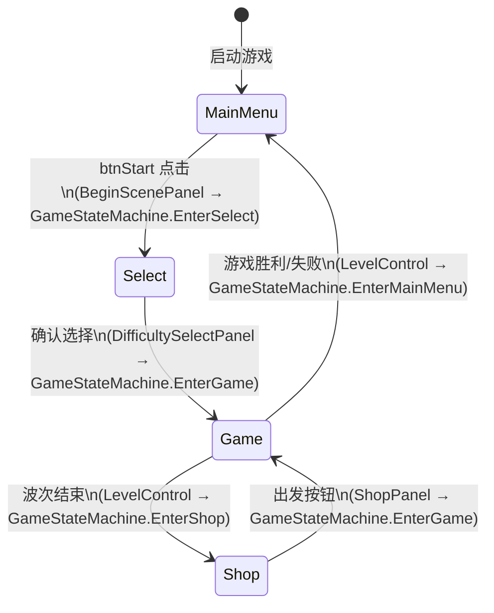

# 架构文档 (ARCHITECTURE)

## 概述

本项目是一个中型 Unity 2D Roguelite 游戏，采用 **MVC + 状态机 + 服务分层** 的架构。

- **状态机（GameStateMachine）** 驱动场景/流程切换（MainMenu → Select → Game → Shop）
- **Services 层** 统一封装外部依赖（音效、JSON 配置、存档）
- **View（Panel）** 只负责展示与转发用户输入，通过 **EventCenter** 与业务层解耦
- **Domain/Model** 保存运行时数据（GameManager 持有公共状态）

---

## 目录结构

```
Assets/
├── Scripts/
│   ├── Framework/
│   │   ├── BaseMgr.cs              # 线程安全非 Mono 单例基类
│   │   ├── BaseMgrMono.cs          # MonoBehaviour 单例基类
│   │   ├── GameManager.cs          # 全局运行时数据（角色/武器/难度/波次等）
│   │   ├── GameStateMachine.cs     # ★ 状态机入口，驱动 SceneStateController
│   │   ├── UIFlowController.cs     # ★ UI 面板互斥管理 / 输入锁定
│   │   ├── MonoMgr.cs              # 提供 Update 回调注册 & 协程代理
│   │   ├── EventCenter.cs          # 事件总线（枚举强类型 + 泛型）
│   │   ├── E_EventType.cs          # ★ 统一事件枚举（玩家/波次/商店/流程/音效）
│   │   ├── UIMgr.cs                # UI 面板实例管理（按名称缓存）
│   │   ├── ResMgr.cs               # Resources 同步/异步加载
│   │   ├── PoolMgr.cs              # 对象池（GameObject + 非 Mono）
│   │   ├── AudioMgr.cs             # 音效播放核心（via EventCenter）
│   │   └── Services/
│   │       ├── AudioService.cs     # ★ 音效 Facade（语义化 API）
│   │       ├── ConfigService.cs    # ★ JSON 配置统一加载（带缓存）
│   │       └── SaveProgressService.cs # ★ 存档/解锁/通关记录（PlayerPrefs 封装）
│   ├── SceneState/
│   │   ├── SceneStateController.cs # 状态控制器（管理切换、异步加载）
│   │   ├── ISceneState.cs          # 状态基类
│   │   ├── StartScene.cs           # ★ MainMenu 状态（播放 BGM / 清 UI 栈）
│   │   ├── SelectSecene.cs         # ★ Select 状态
│   │   ├── GameScene.cs            # ★ Game 状态（重置 isDead）
│   │   └── ShopScene.cs            # ★ Shop 状态（waveCount++）
│   ├── Control/
│   │   └── LevelControl.cs         # ★ 波次/敌人管理，通过事件/状态机跳转
│   ├── Player/
│   │   └── Player.cs               # ★ 通过 EventCenter 发布 HP/Money/Exp 变更
│   ├── Enemy/
│   │   └── EnemyBase.cs            # ★ 死亡时通过事件发布经验变更
│   ├── Weapon/
│   │   └── WeaponBase.cs           # 武器攻击基类
│   ├── UI/
│   │   ├── BasePanel.cs            # UI 面板基类（CanvasGroup Show/Hide）
│   │   ├── BeginScenePanel.cs      # ★ 主菜单 → 通过 GameStateMachine 跳转
│   │   └── GamePanel/
│   │       ├── GamePanel.cs        # ★ 订阅事件更新 HUD（HP/Money/Exp/Timer）
│   │       └── ShopPanel.cs        # ★ 商店 → 通过 GameStateMachine 跳转
│   └── Model/
│       └── PlayerModel.cs          # 玩家属性模型（待整合）
└── docs/
    └── ARCHITECTURE.md             # 本文档
```

> ★ 标注的文件是本次重构新增或重点修改的文件。

---

## 模块关系图（Mermaid）

```mermaid
graph TD
    subgraph Entry["入口 / 驱动层"]
        GM[GameManager<br/>DontDestroyOnLoad<br/>全局运行时数据]
        GSM[GameStateMachine<br/>★ 状态机入口]
    end

    subgraph States["场景状态 (SceneState)"]
        SS[StartScene<br/>01-MainMenu]
        SEL[SelectSecene<br/>02-LevelSelect]
        GS[GameScene<br/>03-GamePlay]
        SHP[ShopScene<br/>04-Shop]
    end

    subgraph Services["Services 层"]
        AS[AudioService<br/>★ 音效 Facade]
        CS[ConfigService<br/>★ JSON 配置]
        SPS[SaveProgressService<br/>★ 存档/解锁]
    end

    subgraph Infrastructure["基础设施"]
        EC[EventCenter<br/>事件总线]
        AMGR[AudioMgr<br/>音效核心]
        RES[ResMgr<br/>资源加载]
        POOL[PoolMgr<br/>对象池]
        MONO[MonoMgr<br/>协程/Update代理]
        UI[UIFlowController<br/>★ 面板互斥]
    end

    subgraph Domain["Domain / Controller"]
        LC[LevelControl<br/>★ 波次/敌人管理]
        PLAYER[Player<br/>★ 移动/受伤/死亡]
        ENEMY[EnemyBase<br/>★ AI/攻击/死亡]
        WPN[WeaponBase<br/>攻击逻辑]
    end

    subgraph View["View (UI Panel)"]
        BSP[BeginScenePanel<br/>★ 主菜单按钮]
        RSP[RoleSelectPanel<br/>角色选择]
        WSP[WeaponSelectPanel<br/>武器选择]
        DSP[DifficultySelectPanel<br/>难度选择]
        GP[GamePanel<br/>★ HUD 事件驱动]
        SHOP[ShopPanel<br/>★ 商店购买]
    end

    %% 状态机驱动场景切换
    GSM -->|SetState| SS
    GSM -->|SetState| SEL
    GSM -->|SetState| GS
    GSM -->|SetState| SHP

    %% Services 被状态和 Manager 调用
    SS -->|PlayMenuBgm| AS
    AS -->|EventTrigger Audio_PlayBgm| EC
    EC -->|OnPlayBgm| AMGR

    GM -->|InitDefaults| SPS
    LC -->|TryUnlockRole| SPS
    PLAYER -->|TryUnlockRole| SPS

    %% 事件总线连接 Domain ↔ View
    PLAYER -->|EventTrigger Player_HpChanged| EC
    PLAYER -->|EventTrigger Player_MoneyChanged| EC
    PLAYER -->|EventTrigger Player_ExpChanged| EC
    PLAYER -->|EventTrigger Player_Dead| EC
    PLAYER -->|EventTrigger Game_Lose| EC
    ENEMY  -->|EventTrigger Player_ExpChanged| EC
    LC     -->|EventTrigger Wave_TimerUpdated| EC
    LC     -->|EventTrigger Wave_Ended| EC
    LC     -->|EventTrigger Game_Win| EC

    EC -->|OnHpChanged| GP
    EC -->|OnMoneyChanged| GP
    EC -->|OnExpChanged| GP
    EC -->|OnTimerUpdated| GP
    EC -->|Game_Lose → BadGame| LC

    %% 场景跳转统一经过 GameStateMachine
    BSP -->|EnterSelect| GSM
    SHOP -->|EnterGame| GSM
    LC  -->|EnterShop / EnterMainMenu| GSM

    %% GameManager 持有数据
    GM -.数据.- PLAYER
    GM -.数据.- LC
    GM -.数据.- ENEMY
    GM -.数据.- WPN
    GM -.数据.- GP
    GM -.数据.- SHOP
```



---

## 状态流转



---

## 关键设计决策

### 1. 为何使用 EventCenter（而非直接调用）

| 场景 | 旧方式 | 新方式 |
|------|--------|--------|
| 玩家受伤后更新血条 | `Player.Injured()` → `GamePanel.Instance.RenewHp()` | `EventTrigger(Player_HpChanged, hp)` → GamePanel 订阅 |
| 敌人死亡后更新经验 | `EnemyBase.Dead()` → `GamePanel.Instance.RenewExp()` | `EventTrigger(Player_ExpChanged, exp)` → GamePanel 订阅 |
| 波次结束跳转商店 | `SceneManager.LoadScene("04-Shop")` | `GameStateMachine.Instance.EnterShop()` |

**好处**：Player/Enemy 不再依赖 GamePanel；GamePanel 不再依赖 Player/Enemy。

### 2. GameStateMachine vs 直接 SceneManager

所有场景跳转都经过 `GameStateMachine`，好处：
- 在 `StateStart()` / `StateEnd()` 中集中处理初始化（音效、UI 栈清空、数据重置）
- 统一入口，方便后续加过场动画、Loading 页面
- 可追踪当前状态，便于调试

### 3. Services 层的职责边界

| Service | 职责 | 不做什么 |
|---------|------|----------|
| `AudioService` | 提供语义化音效 API | 不直接管理 AudioSource |
| `ConfigService` | 统一 JSON 加载与缓存 | 不持有业务数据 |
| `SaveProgressService` | 统一 PlayerPrefs 读写 | 不控制游戏流程 |

### 4. UIFlowController 职责

- 管理面板的互斥打开/关闭（栈结构）
- 输入锁定（对话、过场时禁止玩家操作）
- 场景切换时调用 `ClearAll()` 清空面板栈

---

## 事件清单（E_EventType）

| 事件 | 参数类型 | 触发方 | 订阅方 |
|------|----------|--------|--------|
| `Player_HpChanged` | `float` | Player | GamePanel |
| `Player_MoneyChanged` | `float` | Player | GamePanel |
| `Player_ExpChanged` | `float` | Player, EnemyBase | GamePanel |
| `Player_Dead` | 无 | Player | — |
| `Player_Injured` | `float` | — | — |
| `Wave_Started` | `int` | — | — |
| `Wave_Ended` | 无 | LevelControl | — |
| `Wave_TimerUpdated` | `float` | LevelControl | GamePanel |
| `Wave_InfoUpdated` | `int` | — | GamePanel |
| `Game_Win` | 无 | LevelControl | — |
| `Game_Lose` | 无 | Player | LevelControl |
| `Shop_ItemPurchased` | `ItemData` | — | — |
| `Shop_Refreshed` | 无 | — | — |
| `Flow_Enter*` | 无 | — | — |
| `Audio_PlayBgm` | `AudioBgmRequest` | AudioService | AudioMgr |
| `Audio_PlaySfx` | `AudioPlayRequest` | AudioService | AudioMgr |
| `Audio_StopBgm` | 无 | AudioService | AudioMgr |
| `Audio_SetVolume` | `AudioVolumeRequest` | AudioService | AudioMgr |

---

## 未来扩展建议

1. **Addressables** – 将 `ResMgr.Load<T>` 替换为 Addressables 异步加载，尤其是 UI Prefab
2. **SaveProgressService** – 将 PlayerPrefs 替换为 JSON 文件或云存档
3. **ShopController** – 将 `ShopPanel.Shopping()` 中的购买逻辑提取到独立 Controller
4. **成就系统** – 基于 `Game_Win` / `Player_Dead` 等事件实现
5. **更完整的 UIFlowController** – 支持 DOTween 动画、弹窗层级管理
