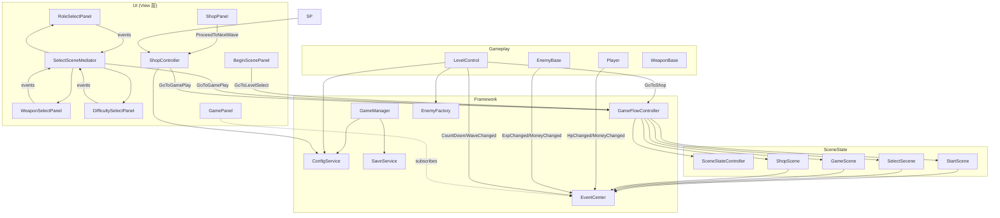
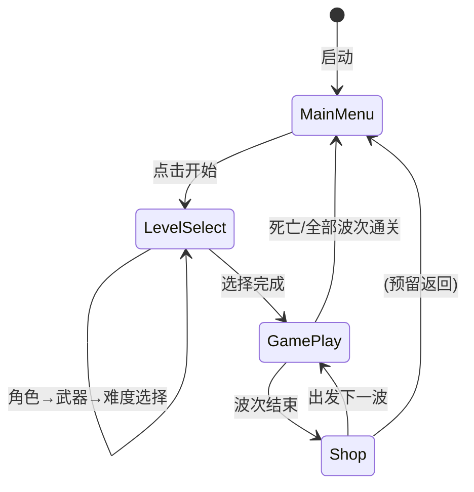

# Architecture Overview

## 1. 模块图

## 2. 场景状态流转

## 3. 层次职责

| 层次 | 类/模块 | 职责 |
|------|---------|------|
| Framework | `GameFlowController` | 场景状态机驱动；唯一调用 `SceneStateController.SetState()` 的地方 |
| Framework | `GameManager` | 运行时可变状态（hp、money、exp、currentWeapons 等） |
| Framework | `ConfigService` | 只读配置数据（JSON 缓存）；各模块通过此类获取静态数据 |
| Framework | `SaveService / ISaveService` | 角色解锁、通关记录持久化；接口隔离，方便替换存储方式 |
| Framework | `EnemyFactory` | 敌人实例化入口；后续替换为 PoolMgr 只需改此类 |
| Framework | `EventCenter` | 发布/订阅事件总线；跨模块通信 |
| UI View | `*Panel` | 只负责展示和抛出事件；不持有其他 Panel 引用 |
| UI Mediator | `SelectSceneMediator` | 协调选择界面三个面板的互斥显示 |
| UI UseCase | `ShopController` | 商店购买/刷新业务逻辑；解耦 ShopPanel 与 GameManager |
| Gameplay | `Player / EnemyBase` | 战斗运行时；通过 EventCenter 通知 UI，不直接调用 GamePanel |
| Gameplay | `LevelControl` | 波次管理；调用 EnemyFactory 生成敌人，调用 GameFlowController 跳场景 |

## 4. 关键解耦点

- **UI 不互相引用**：`RoleUI / WeaponUI / DifficultyUI` 点击后只触发事件；`SelectSceneMediator` 统一协调面板切换。
- **GamePanel 被动刷新**：`Player.Injured()` 触发 `GamePlay_HpChanged` 事件，`GamePanel` 订阅后刷新，两者无直接依赖。
- **场景跳转统一出口**：所有 `SceneManager.LoadScene` 调用收敛至 `GameFlowController`；SceneState 类在切换时统一播放 BGM、初始化 UI。
- **数据加载统一入口**：各面板不再自行 `Resources.Load<TextAsset>(...)`，改为 `ConfigService.Instance.*`；切换 Addressables 只需修改 ConfigService 内部实现。

## 5. 后续演进：从单例到 DI（依赖注入）

当前用单例（`BaseMgr<T>` / `BaseMgrMono<T>`）足以满足需求，且无需额外框架。

若后续引入 Zenject / VContainer 等 DI 容器：

1. 将 `ConfigService / SaveService / AudioMgr` 抽象为接口（`IConfigService`, `ISaveService`, `IAudioService`）。
2. 在 `GameInstaller` 中绑定接口与实现：`Container.Bind<IConfigService>().To<ConfigService>().AsSingle()`。
3. 在 `GameFlowController / ShopController / LevelControl` 构造函数中注入接口，删除 `*Mgr.Instance` 调用。
4. 好处：可在测试中注入 Mock 实现，无需启动 Unity 场景即可验证业务逻辑。

目前代码已做到"单例调用集中在构造/Awake"，迁移成本低。
