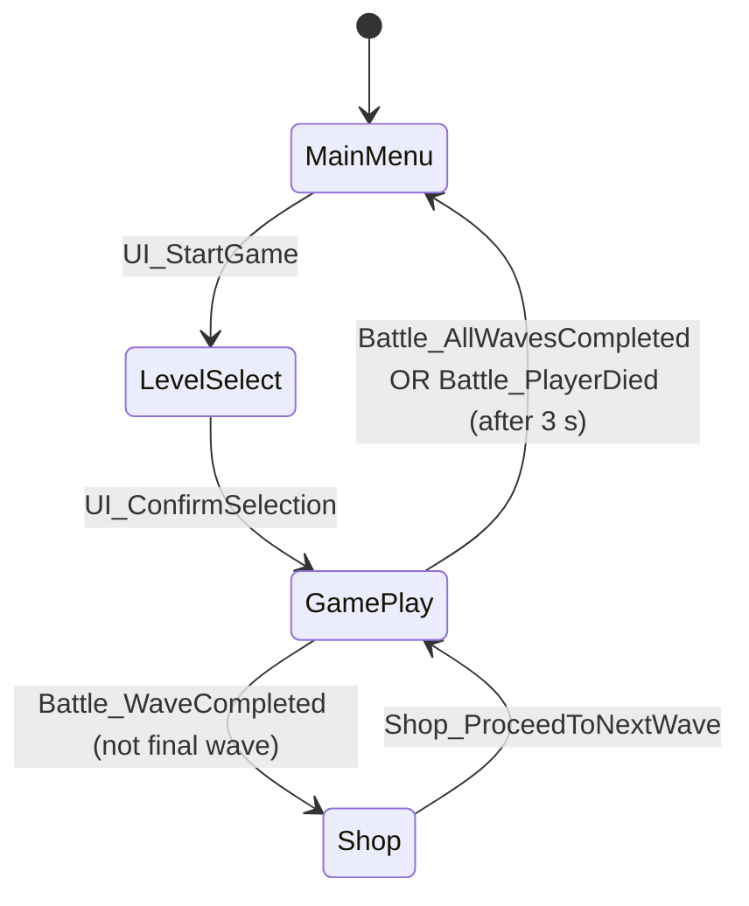
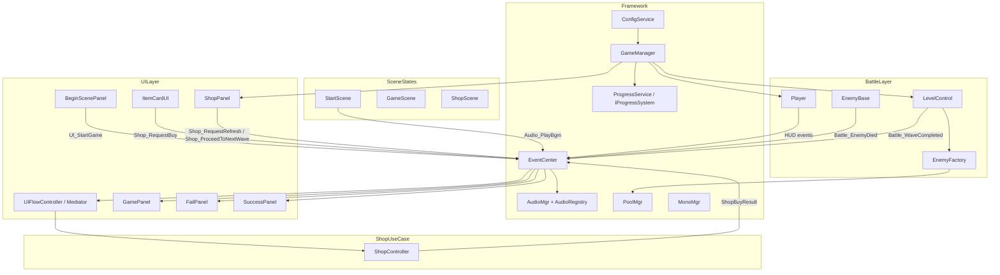

# Architecture Overview – TudouHeroTest

> **Version**: post-refactor  
> **Branch**: `copilot/refactor-architecture-for-playable-portfolio`

---

## 1. Design-Pattern Convergence Decisions

| Pattern | Decision | Reason |
|---|---|---|
| **Facade** | `ConfigService`, `ProgressService`, `ShopController` | Each wraps a subsystem behind a single call point; callers never interact with JSON/PlayerPrefs directly. |
| **Mediator** | `UIFlowController` | Centralises all panel-open/close and scene-transition logic. Panels only fire events; UIFlowController decides what happens next. |
| **EventBus** | `EventCenter` (existing) | Broadcasts state changes (HUD values, battle results, shop results) across layers without creating hard references. |
| **State Machine** | `SceneStateController` + `ISceneState` subclasses | Drives the top-level game flow. Each state owns what happens on entry/exit (BGM, panels). |
| **Factory + Pool** | `EnemyFactory` + `PoolMgr` | Centralised enemy instantiation; callers register prefabs once and call `Spawn()`; `Recycle()` returns objects to the pool. |
| **Observer (event)** | `EventCenter.AddEventListener` | Used for HUD updates, shop callbacks, victory/defeat notifications. |
| **Removed / avoided** | Direct `SceneManager.LoadScene` in panels | Moved entirely to `UIFlowController`. No panel should know which scene comes next. |
| **Removed / avoided** | Business logic in `ShopPanel` | Extracted to `ShopController` (use-case layer). Panel only fires `Shop_RequestBuy`; result comes back via event. |

### Why we did **not** add more patterns

- **Strategy** for enemy AI: existing `EnemyBase` subclass hierarchy is already the "strategy" – adding an extra interface would be over-engineering for this scale.
- **Command** for player input: `Input.GetAxis` polling is sufficient; replaying/undo are not requirements.
- **Decorator** for weapons: JSON-driven `PropData` fusion via `GameManager.FusionAttr` achieves the same runtime modification without extra classes.

---

## 2. State-Machine Flow



### State responsibilities

| State class | Scene | Entry action | Exit action |
|---|---|---|---|
| `StartScene` | `01-MainMenu` | Show `BeginScenePanel`, play `menu_bgm` | Stop BGM |
| `GameScene` | `03-GamePlay` | Fire `Battle_WaveStarted` | Fire `Battle_WaveCompleted` |
| `ShopScene` | `04-Shop` | Fire `HUD_MoneyChanged` | — |

---

## 3. Module Diagram



---

## 4. File / Folder Layout

```
Assets/
├── Scripts/
│   ├── Framework/
│   │   ├── Audio/          – AudioMgr, AudioRegistry, AudioEvent structs
│   │   ├── GameManager.cs  – cross-scene state container
│   │   ├── MonoMgr.cs      – MonoBehaviour bridge (StartCoroutine fixed)
│   │   ├── EventCenter.cs  – EventBus
│   │   └── E_EventType.cs  – all event enum values
│   ├── Services/
│   │   └── ConfigService.cs        – centralised JSON loader (single source of truth)
│   ├── Progress/
│   │   ├── IProgressSystem.cs      – unlock/achievement interface
│   │   ├── PlayerPrefsProgressService.cs – default implementation
│   │   └── ProgressService.cs      – facade (BaseMgr singleton)
│   ├── Shop/
│   │   ├── ShopController.cs       – buy/refresh use-case logic
│   │   └── ShopBuyResult.cs        – result struct
│   ├── Battle/
│   │   └── EnemyFactory.cs         – Factory + Pool unified spawn entry
│   ├── UI/
│   │   ├── UIFlowController.cs     – UI Mediator
│   │   ├── BeginScenePanel.cs      – view only (fires events)
│   │   ├── GamePanel/
│   │   │   ├── GamePanel.cs        – HUD (listens events)
│   │   │   ├── ShopPanel.cs        – shop view (delegates to ShopController)
│   │   │   ├── ItemCardUI.cs       – card view (fires Shop_RequestBuy)
│   │   │   ├── FailPanel.cs        – listens Battle_PlayerDied
│   │   │   └── SuccessPanel.cs     – listens Battle_AllWavesCompleted
│   │   └── SelectPanel/
│   │       ├── RoleSelectPanel.cs
│   │       ├── WeaponSelectPanel.cs
│   │       └── DifficultySelectPanel.cs
│   ├── SceneState/
│   │   ├── ISceneState.cs
│   │   ├── SceneStateController.cs
│   │   ├── StartScene.cs
│   │   ├── GameScene.cs
│   │   └── ShopScene.cs
│   ├── Player/
│   │   └── Player.cs
│   ├── Enemy/
│   │   ├── EnemyBase.cs
│   │   └── Enemy1-5.cs
│   └── Control/
│       └── LevelControl.cs
└── Resources/
    └── Data/
        ├── role.json
        ├── weapon.json
        ├── enemy.json
        ├── prop.json
        ├── difficulty.json
        └── level0.json … levelN.json
```

---

## 5. Key Event Map

| Event | Producer | Consumer(s) |
|---|---|---|
| `UI_StartGame` | `BeginScenePanel` | `UIFlowController` → `SceneManager.LoadScene("02-LevelSelect")` |
| `UI_ConfirmSelection` | `DifficultyUI` | `UIFlowController` → load `03-GamePlay` |
| `Battle_WaveStarted` | `GameScene` (state) | — (extension point) |
| `Battle_WaveCompleted` | `GameScene` (state) | — (extension point) |
| `Battle_PlayerDied` | `LevelControl.BadGame()` | `FailPanel.Show()`, `UIFlowController` |
| `Battle_AllWavesCompleted` | `LevelControl.GoodGame()` | `SuccessPanel.Show()`, `UIFlowController`, `ProgressService` |
| `HUD_MoneyChanged` | `Player`, `ShopController` | `GamePanel.RenewMoney()`, `ShopPanel.RefreshMoneyText()` |
| `HUD_HpChanged` | `Player` | `GamePanel.RenewHp()` |
| `HUD_ExpChanged` | `EnemyBase.Dead()` | `GamePanel.RenewExp()` |
| `Shop_RequestBuy` | `ItemCardUI` | `UIFlowController` → `ShopController.TryBuy()` |
| `Shop_BuyResult` | `UIFlowController` | `ItemCardUI`, `ShopPanel` |
| `Shop_RequestRefresh` | `ShopPanel` button | `UIFlowController` → `ShopController.TryRefresh()` |
| `Shop_RefreshResult` | `UIFlowController` | `ShopPanel.OnRefreshResult()` |
| `Shop_ProceedToNextWave` | `ShopPanel` button | `UIFlowController` → load `03-GamePlay` |
| `Audio_PlayBgm` | `StartScene.StateStart()` | `AudioMgr` |
| `Audio_PlaySfx` | `Player`, `WeaponShort`, `WeaponLong`, `Hover` | `AudioMgr` |

---

## 6. How to Add Achievement / Unlock / Save Systems

### Achievement system
1. Add `void CheckAchievements(AchievementContext ctx)` to `IProgressSystem`.
2. Implement in `PlayerPrefsProgressService.OnGameCompleted()`.
3. Create `AchievementContext` struct with: kills, wavesCleared, hpRemaining, etc.
4. Fire `Battle_EnemyDied` events carry `EnemyBase`; a new `AchievementTracker` can accumulate counts without modifying existing classes.

### Cloud save / different save backend
1. Create `class CloudProgressService : IProgressSystem`.
2. Call `ProgressService.Instance.SetImplementation(new CloudProgressService())` on startup.
3. Zero changes to callers.

### Unlock new roles at runtime
- Call `ProgressService.Instance.UnlockRole("新角色名")`.
- `PlayerPrefsProgressService.UnlockRole` updates `GameManager.roleDatas` immediately so the select panel shows the unlocked state without reloading.

### Save mid-run state (for resume)
1. Add a `SaveRunState()` method to `IProgressSystem` that serialises `GameManager` fields (currentWave, money, propData, currentWeapons, currentProps).
2. Deserialise and restore in `GameManager.Awake()` if a save file is found.

---

## 7. Remaining TODO / Known Gaps

| Item | Priority | Note |
|---|---|---|
| Addressables loading path | Medium | `ConfigService.LoadRaw()` can be swapped to `Addressables.LoadAssetAsync`; no caller changes needed. |
| `UIFlowController` scene presence | Medium | Currently created per-scene; should be moved to a persistent bootstrap scene or `DontDestroyOnLoad`. |
| `LevelControl._failPanel / _successPanel` Inspector refs | Low | Removed; panels now self-manage via events. Remove the serialised fields from the Inspector in the prefab. |
| Full Addressables UI init | Low | `UIMgr.ShowPanel<BeginScenePanel>()` in `StartScene.StateStart()` will work once the panel prefab is registered under the correct Addressable key. |
| Input system migration | Low | `Input.GetAxis` → `InputSystem.ReadValue` when needed. |
