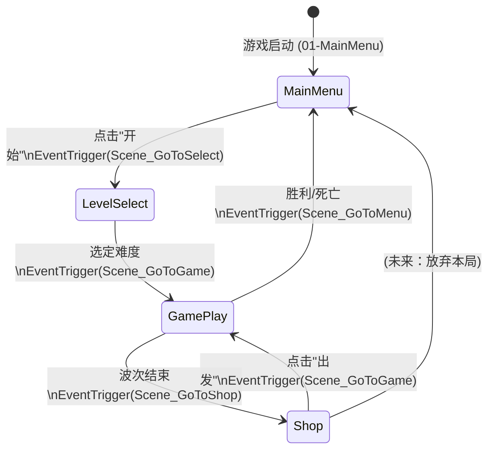
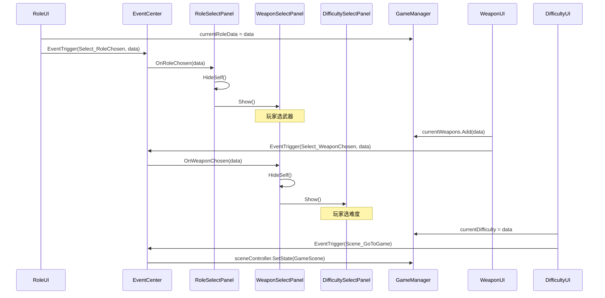
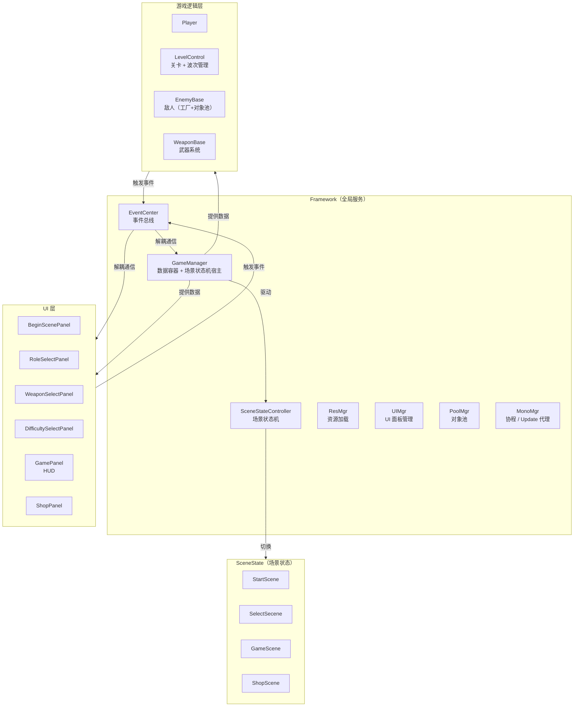
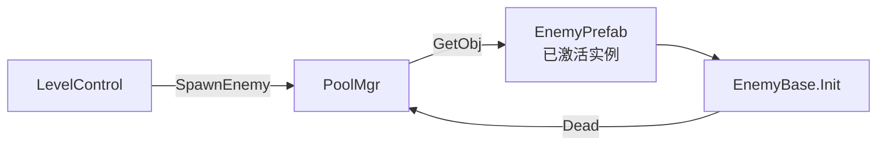

# 架构文档 · TudouHero

> 版本：2025-Q2 重构后基准版本
> 定位：作品集项目 / Unity 学习性商业化参考工程

---

## 1. 全局设计原则

| 原则 | 落地方式 |
|---|---|
| **单一入口** | 游戏必须从 `01-MainMenu` 启动（`GameManager` 在此创建，DontDestroyOnLoad） |
| **场景切换统一管理** | 所有场景跳转通过 `EventCenter` 发布事件 → `GameManager` 中的 `SceneStateController` 执行 |
| **UI 不直接加载场景** | Panel / UI 组件只负责显示和发布用户行为事件，不调用 `SceneManager` |
| **配置数据集中加载** | JSON 数据在 `GameManager.Awake()` 统一读取；各 Panel 直接使用 `GameManager.Instance.*Datas`，避免重复 IO |
| **事件驱动解耦** | 跨层通信（UI → 逻辑、逻辑 → 音效）优先走 `EventCenter`，避免直接获取对方单例引用 |

---

## 2. 场景状态流转



**状态机宿主**：`GameManager`（MonoBehaviour，DontDestroyOnLoad）  
**状态对象**：`StartScene / SelectSecene / GameScene / ShopScene`（纯 C# 类，继承 `ISceneState`）  
**驱动者**：`GameManager.Update()` 每帧调用 `SceneStateController.StateUpdate()`

---

## 3. 选择场景内部流程（02-LevelSelect）



**改进要点**：`RoleUI` / `WeaponUI` 不再直接引用其他 Panel 单例；  
面板间跳转逻辑由各 Panel 自身监听事件并执行，职责清晰。

---

## 4. 模块职责一览



---

## 5. EventCenter 使用规范

### 5.1 事件类型定义（`E_EventType.cs`）

所有事件在 `E_EventType` 枚举中集中定义，并按以下前缀分组：

| 前缀 | 用途 |
|---|---|
| `Scene_` | 场景切换请求（由 UI 发布，GameManager 消费） |
| `Select_` | 选择场景内的选择流程（角色 / 武器） |
| `Game_` | 游戏运行时状态变化（HP、金币、经验） |
| `Audio_` | 音效控制指令（播放 BGM / SFX、停止、音量） |

### 5.2 订阅与取消订阅

```csharp
// 在 Start() 中订阅
EventCenter.Instance.AddEventListener<RoleData>(E_EventType.Select_RoleChosen, OnRoleChosen);

// 在 OnDestroy() 中取消，防止场景销毁后的悬挂引用
private void OnDestroy()
{
    EventCenter.Instance.RemoveEventListener<RoleData>(E_EventType.Select_RoleChosen, OnRoleChosen);
}
```

### 5.3 发布事件

```csharp
// 无参事件（场景切换）
EventCenter.Instance.EventTrigger(E_EventType.Scene_GoToSelect);

// 带参事件（传数据）
EventCenter.Instance.EventTrigger(E_EventType.Select_RoleChosen, roleData);
```

### 5.4 谁不应该用 EventCenter

- **同一 MonoBehaviour 内部**的方法调用（直接调用即可）
- **父子组件之间**的简单通信（可用 UnityEvent 或直接引用）
- **热路径代码**（Update 每帧高频调用，改用直接引用性能更好）

---

## 6. 数据层

### 6.1 配置数据（只读，来自 JSON）

| 数据类 | JSON 文件 | 加载位置 |
|---|---|---|
| `RoleData` | `Resources/Data/role.json` | `GameManager.Awake()` |
| `WeaponData` | `Resources/Data/weapon.json` | `GameManager.Awake()` |
| `EnemyData` | `Resources/Data/enemy.json` | `GameManager.Awake()` |
| `PropData` | `Resources/Data/prop.json` | `GameManager.Awake()` |
| `DifficultyData` | `Resources/Data/difficulty.json` | `GameManager.Awake()` |
| `LevelData` | `Resources/Data/level{N}.json` | `LevelControl.Awake()` |

### 6.2 会话数据（运行时可变）

存储在 `GameManager` 中，生命周期为"一局游戏"，通过 `ResetSession()` 在进入选择场景时重置：

- `currentRoleData`、`currentDifficulty`
- `currentWeapons`、`currentProps`
- `propData`（累积的属性，含商店购买）
- `hp`、`money`、`exp`、`currentWave`

### 6.3 持久化数据（PlayerPrefs）

| Key | 类型 | 用途 |
|---|---|---|
| `"多面手"` | int (0/1) | 角色解锁状态 |
| `"公牛"` | int (0/1) | 角色解锁状态 |

> **TODO（成就系统）**：目前解锁条件硬编码在 `LevelControl.GoodGame()` 和 `Player.Start()` 中。
> 后续可引入 `AchievementService`，统一管理解锁条件检查、PlayerPrefs 写入、解锁事件发布。
> 接口草案：`IAchievementService.Check(AchievementId id, float value)`

---

## 7. 对象池与工厂



- `PoolMgr` 已实现带上限的对象池（`PoolData`）
- 预制体需挂载 `PoolObj` 组件设定上限
- **TODO**：将 `LevelControl` 中的敌人生成提炼为 `EnemyFactory`，统一通过工厂 + 对象池接口创建

---

## 8. 待完善的设计（TODO 路线图）

| 优先级 | 项目 | 说明 |
|---|---|---|
| 高 | 音效系统 | 将 `GameManager` 中的音效预制体迁移至独立 `AudioMgr`，监听 `Audio_*` 事件统一播放 |
| 高 | 敌人工厂 | 将 `LevelControl` 中的字典 + `Instantiate` 提炼为 `EnemyFactory`，配合对象池 |
| 中 | 成就系统 | `AchievementService` 集中管理解锁条件，替代分散的 PlayerPrefs 判断 |
| 中 | 存档系统 | `SaveService` 将解锁状态、历史记录序列化为 JSON，替代 PlayerPrefs |
| 低 | 依赖注入 | 当服务增多时，引入 `ServiceLocator` 或 VContainer，替代直接的 `XXX.Instance` 调用 |
| 低 | Addressables | 将 `Resources.Load` 替换为 Addressables 异步加载，减少启动内存占用 |
