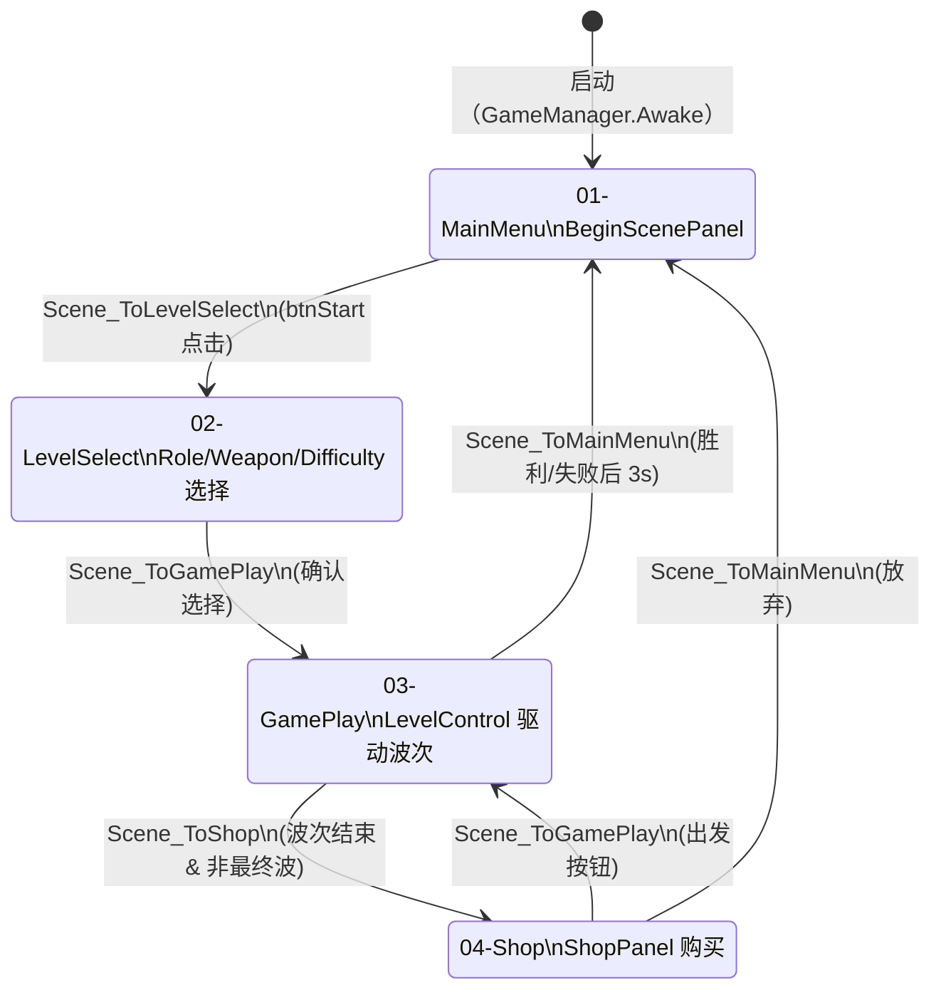
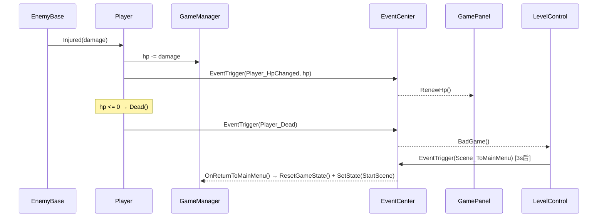
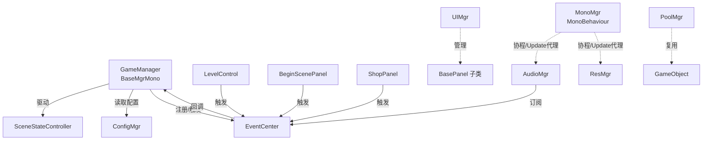

# 架构文档 · TudouHeroTest

## UML 文件与使用方法

本仓库在 `docs/uml/` 目录下提供两种格式的 MVC 架构图：

| 文件 | 格式 | 用途 |
|------|------|------|
| [`docs/uml/mvc-architecture.puml`](uml/mvc-architecture.puml) | PlantUML | 完整类图，含分层分包、设计模式标注 |
| [`docs/uml/mvc-architecture.mmd`](uml/mvc-architecture.mmd) | Mermaid | 结构与 PlantUML 版本一致，可在 GitHub 直接预览 |

### PlantUML 渲染方式

1. **VSCode 插件**：安装 [PlantUML](https://marketplace.visualstudio.com/items?itemName=jebbs.plantuml) 插件，打开 `.puml` 文件后按 `Alt+D` 预览。需本地安装 Java 和 Graphviz，或在插件设置中配置 PlantUML Server。
2. **在线 PlantUML Server**：访问 <https://www.plantuml.com/plantuml/uml/>，将 `.puml` 文件内容粘贴后渲染。
3. **本地 JAR**：下载 [plantuml.jar](https://plantuml.com/download) 后执行：
   ```bash
   java -jar plantuml.jar docs/uml/mvc-architecture.puml
   ```

### Mermaid 在 GitHub 中查看

GitHub 原生支持 Mermaid。直接在浏览器中打开 [`docs/uml/mvc-architecture.mmd`](uml/mvc-architecture.mmd) 即可看到渲染后的类图。也可在任意 Markdown 文件中嵌入：

````markdown
```mermaid
classDiagram
    ...
```
````

---

## UML 层次说明

架构图分为以下层次（对应 PlantUML/Mermaid 中的 package 分组）：

| 层次 | 说明 | 主要类 |
|------|------|--------|
| **Infra · Infrastructure** | 跨场景持久化基础设施，全部为单例服务 | `BaseMgr<T>`、`BaseMgrMono<T>`、`EventCenter`、`ConfigMgr`、`UIMgr`、`PoolMgr`、`AudioMgr`、`MonoMgr`、`ResMgr` |
| **MVC · Model** | 运行时游戏状态与数据结构 | `GameManager`、`RoleData`、`WeaponData`、`EnemyData`、`DifficultyData`、`LevelData`、`PlayerModel` |
| **MVC · View** | UI 面板展示层，通过 EventCenter 接收更新 | `BasePanel`、`GamePanel`、`BeginScenePanel`、`ShopPanel`、`RoleSelectPanel` 等 |
| **MVC · Controller** | 业务逻辑与场景流转控制 | `GameManager`、`SceneStateController`、`LevelControl`、`Player`、各 Scene State 类 |
| **Game Objects** | 游戏实体（敌人、武器、子弹） | `EnemyBase`/Enemy1-5、`WeaponBase`/具体武器、`Bullet`/具体子弹 |

> **Infra = Infrastructure**（基础设施层）：指不依赖具体游戏业务逻辑、可跨项目复用的通用服务框架，包括单例基类、事件总线、对象池、资源加载、音频管理等。

---

## MVC 总体架构图（含设计模式标注）

> 以下 Mermaid 图可在 GitHub 页面直接渲染。完整类图（含所有字段/方法/继承）请查看 [`docs/uml/mvc-architecture.mmd`](uml/mvc-architecture.mmd) 或 [`docs/uml/mvc-architecture.puml`](uml/mvc-architecture.puml)。

```mermaid
classDiagram
    direction TB

    %% ── Infra 基础设施层 ──────────────────────────────────────────────────
    namespace Infra_单例模式_Singleton {
        class BaseMgr["BaseMgr＜T＞\n《Singleton Base · 纯C#》"]
        class BaseMgrMono["BaseMgrMono＜T＞\n《Singleton Base · MonoBehaviour》"]
    }

    namespace Infra_观察者_EventBus {
        class EventCenter["EventCenter\n《Observer · EventBus》\n+AddEventListener()\n+EventTrigger()"]
        class E_EventType["E_EventType\n《enum》\nScene_To* | Player_*\nWave_* | Audio_*"]
    }

    namespace Infra_外观模式_Facade {
        class ConfigMgr["ConfigMgr\n《Facade · Service》\n+LoadList(key)"]
        class UIMgr["UIMgr\n《Facade · Service》\n+ShowPanel()"]
        class PoolMgr["PoolMgr\n《Facade · Service》\n+GetObj() / PushObj()"]
        class ResMgr["ResMgr\n《Facade · Service》\n+Load() / LoadAsync()"]
        class AudioMgr["AudioMgr\n《Facade · AudioSystem》\n+PlayBgm(id)\n+PlaySfx(id)\n订阅 Audio_* 事件"]
        class MonoMgr["MonoMgr\n《Proxy · Lifecycle Adapter》\n+AddUpdateListener()\n+StartCoroutine()"]
    }

    %% ── MVC · Model ────────────────────────────────────────────────────
    namespace MVC_Model {
        class GameManager["GameManager\n《Controller + Model Hub》\n+hp / money / exp / waveIndex\n+ResetGameState()"]
        class RoleData
        class WeaponData
        class DifficultyData
        class EnemyData
        class LevelData
    }

    %% ── MVC · View ─────────────────────────────────────────────────────
    namespace MVC_View {
        class BasePanel["BasePanel\n《abstract · Template Method》\n+ShowPanel() / HidePanel()"]
        class BeginScenePanel
        class GamePanel["GamePanel\n+RenewHp(hp)\n+RenewMoney(money)"]
        class ShopPanel
        class RoleSelectPanel
        class WeaponSelectPanel
        class DifficultySelectPanel
    }

    %% ── MVC · Controller & 状态模式 ────────────────────────────────────
    namespace MVC_Controller_状态模式_State {
        class SceneStateController["SceneStateController\n《Context · State Pattern》\n+SetState(state, isLoadScene)\n+StateUpdate()"]
        class ISceneState["ISceneState\n《State · abstract》\n+StateStart() / StateEnd()"]
        class StartScene["StartScene\n01-MainMenu"]
        class SelectSecene["SelectSecene\n02-LevelSelect"]
        class GameScene["GameScene\n03-GamePlay"]
        class ShopScene["ShopScene\n04-Shop"]
        class LevelControl["LevelControl\n+StartWave() / SpawnEnemy()\n+BadGame() / GoodGame()"]
        class Player["Player\n+Injured(damage) / Dead()"]
    }

    %% ── Singleton 继承 ────────────────────────────────────────────────
    BaseMgr <|-- EventCenter
    BaseMgr <|-- ConfigMgr
    BaseMgr <|-- UIMgr
    BaseMgr <|-- PoolMgr
    BaseMgr <|-- ResMgr
    BaseMgr <|-- AudioMgr
    BaseMgrMono <|-- GameManager
    BaseMgrMono <|-- GamePanel
    BaseMgrMono <|-- ShopPanel
    BaseMgrMono <|-- RoleSelectPanel
    BaseMgrMono <|-- WeaponSelectPanel
    BaseMgrMono <|-- DifficultySelectPanel
    BaseMgrMono <|-- LevelControl
    BaseMgrMono <|-- Player

    %% ── 状态模式继承 ────────────────────────────────────────────────────
    ISceneState <|-- StartScene
    ISceneState <|-- SelectSecene
    ISceneState <|-- GameScene
    ISceneState <|-- ShopScene
    SceneStateController o-- ISceneState : currentState

    %% ── View 继承 ───────────────────────────────────────────────────────
    BasePanel <|-- BeginScenePanel

    %% ── EventCenter 依赖（Observer 订阅/发布）────────────────────────────
    EventCenter --> E_EventType : key
    AudioMgr ..> EventCenter : 订阅 Audio_PlayBgm\nAudio_PlaySfx / Audio_StopBgm
    AudioMgr ..> MonoMgr : StartCoroutine
    AudioMgr ..> PoolMgr : 复用 AudioSourcePooled
    GameManager ..> EventCenter : 订阅 Scene_To*
    GameManager --> SceneStateController : 驱动 Update→StateUpdate
    GameManager --> ConfigMgr : Awake 读取配置
    LevelControl ..> EventCenter : 触发 Wave_* / Scene_To*
    Player ..> EventCenter : 触发 Player_HpChanged\nPlayer_Dead
    BeginScenePanel ..> EventCenter : 触发 Scene_ToLevelSelect
    ShopPanel ..> EventCenter : 触发 Scene_ToGamePlay\nScene_ToMainMenu
    DifficultySelectPanel ..> EventCenter : 触发 Scene_ToGamePlay
    EventCenter ..> GamePanel : 回调 RenewHp/Money/Wave
    EventCenter ..> GameManager : 回调场景切换
    EventCenter ..> AudioMgr : 派发 Audio_* 事件
    UIMgr ..> BasePanel : manages
    GameManager *-- RoleData
    GameManager *-- WeaponData
    GameManager *-- DifficultyData
    ConfigMgr ..> RoleData : loads
    ConfigMgr ..> WeaponData : loads
    ConfigMgr ..> EnemyData : loads
    ConfigMgr ..> LevelData : loads
```



---

| 模式 | 实现类 | 说明 |
|------|--------|------|
| **单例（Singleton）** | `BaseMgr<T>`、`BaseMgrMono<T>` | 双重检查锁 / MonoBehaviour 单例基类；EventCenter / ConfigMgr / UIMgr / PoolMgr / ResMgr / AudioMgr 继承 BaseMgr；GameManager / GamePanel / LevelControl / Player 等继承 BaseMgrMono |
| **状态（State）** | `ISceneState`（Context: `SceneStateController`）、`StartScene` / `SelectSecene` / `GameScene` / `ShopScene` | 场景状态机：SetState() 触发 StateEnd→异步加载→StateStart，每帧 StateUpdate 驱动当前状态 |
| **事件中心 / 观察者（Observer / EventBus）** | `EventCenter`、`E_EventType` | 类型安全的发布-订阅事件总线；Audio_* 事件由 AudioMgr 订阅，Player_* / Wave_* / Scene_* 分别由对应系统订阅 |
| **外观（Facade / 服务管理器集合）** | `ConfigMgr`、`ResMgr`、`UIMgr`、`AudioMgr`、`PoolMgr`、`MonoMgr` | 各管理器封装子系统复杂性，向业务层提供统一简洁的服务入口 |
| **生命周期代理（Proxy / Adapter）** | `MonoMgr` | 自身为 MonoBehaviour 单例，为纯 C# 管理器（如 AudioMgr）代理 Unity Update 事件与协程能力 |
| **对象池（Object Pool）** | `PoolMgr`、`PoolData`、`AudioSourcePooled` | 复用 GameObject（含音效 AudioSource），减少 GC 压力 |
| **模板方法（Template Method）** | `BasePanel`、`WeaponBase`、`EnemyBase` | 定义 Show/Hide/Init / Attack / Dead 生命周期钩子，子类实现具体行为 |

---

## 概览

```
Assets/Scripts/
├── Framework/          # 全局服务单例（跨场景持久）
│   ├── GameManager     # 游戏状态 + 场景流程驱动
│   ├── ConfigMgr       # JSON 配置统一加载入口
│   ├── EventCenter     # 跨系统事件广播总线
│   ├── UIMgr           # UI 面板生命周期管理
│   ├── AudioMgr        # 音效服务（通过 EventCenter 触发）
│   ├── PoolMgr         # 对象池
│   ├── ResMgr          # Resources 异步加载封装
│   ├── MonoMgr         # 非 MonoBehaviour 管理器的协程/Update 代理
│   └── BaseMgr / BaseMgrMono  # 单例基类
├── SceneState/         # 场景状态机
│   ├── ISceneState
│   ├── SceneStateController
│   ├── StartScene      → 01-MainMenu
│   ├── SelectSecene    → 02-LevelSelect
│   ├── GameScene       → 03-GamePlay
│   └── ShopScene       → 04-Shop
├── UI/
│   ├── BasePanel
│   ├── BeginScenePanel
│   ├── SelectPanel/    # RoleSelectPanel / WeaponSelectPanel / DifficultySelectPanel
│   └── GamePanel/      # GamePanel / ShopPanel
├── Player/             # Player（移动/受伤/死亡）
├── Enemy/              # EnemyBase 及派生类
├── Weapon/             # WeaponBase 及派生类
├── Control/            # LevelControl（波次/胜负判定）
├── Data/               # 数据结构（RoleData / WeaponData / PropData …）
└── Model/              # PlayerModel（预留，待 DI 改造时替代 GameManager 的状态部分）
```

---

## 核心原则

| 层次 | 职责 | 不应做的事 |
|------|------|-----------|
| **EventCenter** | 跨系统广播（血量/金币变化、波次事件） | 驱动场景切换或 UI 打开/关闭 |
| **SceneStateController** | 异步加载场景，协调 StateStart/StateEnd | 持有业务数据 |
| **GameManager** | 持有运行时状态；监听 Scene_* 事件驱动状态机 | 直接调用 SceneManager.LoadScene |
| **UIPanel** | 显示数据；抛出按钮点击事件 | 直接引用其他 Panel 或调用场景跳转 |
| **ConfigMgr** | 统一 JSON 加载，返回独立副本 | 持有可变游戏状态 |

---

## 场景流转状态图



---

## 事件流（以"玩家受伤"为例）



---

## 单例服务关系



---

## DI 演进路线（备注）

```csharp
// 当前：静态单例直接访问
GameManager.Instance.money -= price;

// TODO 演进步骤：
// 1. 提取接口：IGameState, IConfigService, IEventBus
// 2. 用 ServiceLocator 注册（比全局单例好测试）：
//    ServiceLocator.Register<IGameState>(new GameState());
//    ServiceLocator.Get<IGameState>().money -= price;
// 3. 最终目标：构造函数注入（Zenject / VContainer），
//    彻底消除静态依赖，便于单元测试和热重载
```

---

## 配置数据路径约定

所有 JSON 配置存放在 `Assets/Resources/Data/`，通过 `ConfigMgr.LoadList<T>(key)` 加载：

| key | 类型 | 说明 |
|-----|------|------|
| `enemy` | `List<EnemyData>` | 全部敌人基础属性 |
| `role` | `List<RoleData>` | 可选角色（含解锁状态） |
| `weapon` | `List<WeaponData>` | 全部武器 |
| `prop` | `List<PropData>` | 全部道具 |
| `difficulty` | `List<DifficultyData>` | 难度列表 |
| `{difficulty.levelName}` | `List<LevelData>` | 对应难度的关卡波次数据 |
