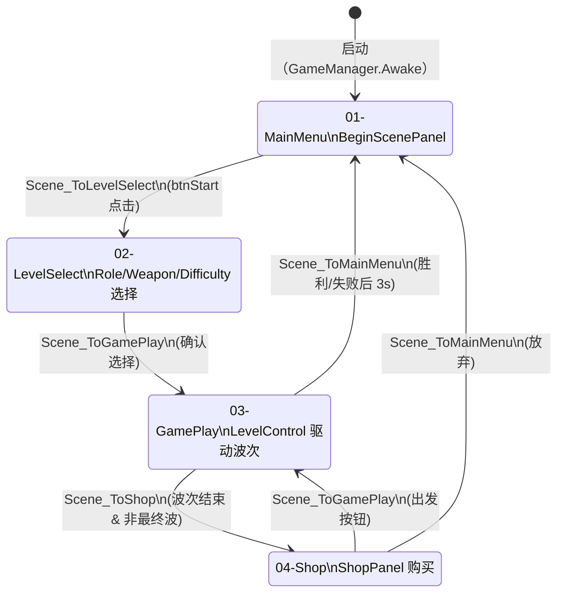
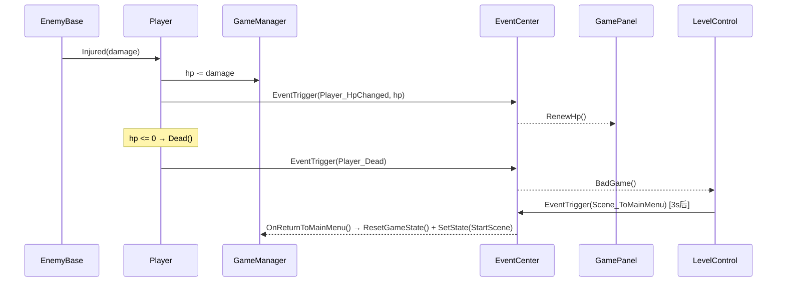
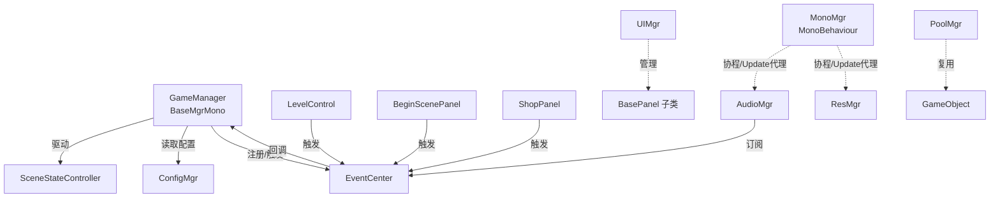

# 架构文档 · TudouHeroTest

## UML 图查看说明

本仓库在 `docs/uml/` 目录下提供两种格式的 MVC 总体架构图：

| 文件 | 格式 | 说明 |
|------|------|------|
| [`docs/uml/mvc-architecture.puml`](uml/mvc-architecture.puml) | PlantUML | 推荐用于离线生成高质量 PNG/SVG |
| [`docs/uml/mvc-architecture.mmd`](uml/mvc-architecture.mmd) | Mermaid | 可在 GitHub 页面直接渲染预览 |

### 查看 Mermaid 图（GitHub 直接预览）

GitHub 原生支持在 Markdown 中渲染 Mermaid 代码块。  
若要在 GitHub 上直接预览 `.mmd` 文件，可将其内容复制到任意 Markdown 文件的代码块中：

````markdown
```mermaid
（粘贴 mvc-architecture.mmd 的内容）
```
````

或在线使用 [Mermaid Live Editor](https://mermaid.live/) 粘贴内容渲染。

### 生成 PlantUML PNG / SVG

**方法一：VSCode PlantUML 插件**
1. 安装插件：[PlantUML（jebbs.plantuml）](https://marketplace.visualstudio.com/items?itemName=jebbs.plantuml)
2. 打开 `docs/uml/mvc-architecture.puml`
3. 按 `Alt+D`（macOS: `Option+D`）预览；或右键选择 **Export Current Diagram**

**方法二：PlantUML 在线服务器**
将以下链接中的内容替换为实际编码后的 PUML，即可获取 PNG：
```
https://www.plantuml.com/plantuml/png/{encoded}
```
或直接访问 [PlantUML Server](http://www.plantuml.com/plantuml/uml/) 粘贴内容渲染。

**方法三：diagrams.net（draw.io）导入**
在 diagrams.net 中选择 **Extras → Edit Diagram**，粘贴 PUML 内容后选择 PlantUML 格式导入。

> **Infra = Infrastructure（基础设施层）**  
> 图中 `Infra` 包代表跨场景持久存在的基础服务，包括单例基类（`BaseMgr` / `BaseMgrMono`）、事件总线（`EventCenter`）、以及生命周期代理（`MonoMgr`）等。

---

## 概览

```
Assets/Scripts/
├── Framework/          # 全局服务单例（跨场景持久）
│   ├── GameManager     # 游戏状态 + 场景流程驱动
│   ├── ConfigMgr       # JSON 配置统一加载入口
│   ├── EventCenter     # 跨系统事件广播总线
│   ├── UIMgr           # UI 面板生命周期管理
│   ├── AudioMgr        # 音效服务（通过 EventCenter 触发）
│   ├── PoolMgr         # 对象池
│   ├── ResMgr          # Resources 异步加载封装
│   ├── MonoMgr         # 非 MonoBehaviour 管理器的协程/Update 代理
│   └── BaseMgr / BaseMgrMono  # 单例基类
├── SceneState/         # 场景状态机
│   ├── ISceneState
│   ├── SceneStateController
│   ├── StartScene      → 01-MainMenu
│   ├── SelectSecene    → 02-LevelSelect
│   ├── GameScene       → 03-GamePlay
│   └── ShopScene       → 04-Shop
├── UI/
│   ├── BasePanel
│   ├── BeginScenePanel
│   ├── SelectPanel/    # RoleSelectPanel / WeaponSelectPanel / DifficultySelectPanel
│   └── GamePanel/      # GamePanel / ShopPanel
├── Player/             # Player（移动/受伤/死亡）
├── Enemy/              # EnemyBase 及派生类
├── Weapon/             # WeaponBase 及派生类
├── Control/            # LevelControl（波次/胜负判定）
├── Data/               # 数据结构（RoleData / WeaponData / PropData …）
└── Model/              # PlayerModel（预留，待 DI 改造时替代 GameManager 的状态部分）
```

---

## 核心原则

| 层次 | 职责 | 不应做的事 |
|------|------|-----------|
| **EventCenter** | 跨系统广播（血量/金币变化、波次事件） | 驱动场景切换或 UI 打开/关闭 |
| **SceneStateController** | 异步加载场景，协调 StateStart/StateEnd | 持有业务数据 |
| **GameManager** | 持有运行时状态；监听 Scene_* 事件驱动状态机 | 直接调用 SceneManager.LoadScene |
| **UIPanel** | 显示数据；抛出按钮点击事件 | 直接引用其他 Panel 或调用场景跳转 |
| **ConfigMgr** | 统一 JSON 加载，返回独立副本 | 持有可变游戏状态 |

---

## MVC 总体架构类图

> 完整可渲染版本见 [`docs/uml/mvc-architecture.puml`](uml/mvc-architecture.puml)（PlantUML）和 [`docs/uml/mvc-architecture.mmd`](uml/mvc-architecture.mmd)（Mermaid）。  
> 下方为内嵌的 Mermaid 精简版，可在 GitHub 上直接渲染。

```mermaid
classDiagram
    %% ── Infra（基础设施层）──────────────────────────────
    class BaseMgr~T~ {
        <<Singleton>>
        +Instance() T$
    }
    class BaseMgrMono~T~ {
        <<Singleton-Mono>>
        +Instance() T$
        +Awake()
    }
    class MonoMgr {
        <<Adapter-Proxy>>
        +AddUpdateListener(fn)
        +StartCoroutine(routine)
    }
    class EventCenter {
        <<Observer-EventBus>>
        +AddEventListener(type, action)
        +EventTrigger(type)
    }
    class E_EventType {
        <<enumeration>>
        Scene_ToMainMenu
        Scene_ToLevelSelect
        Scene_ToGamePlay
        Scene_ToShop
        Player_HpChanged
        Audio_PlayBgm
    }

    %% ── View / 服务管理器群（Facade-ish）────────────────
    class UIMgr {
        <<Facade-Singleton>>
        +ShowPanel~T~() T
        +HidePanel~T~()
    }
    class AudioMgr {
        +PlayBgm(key, loop)
    }
    class ResMgr {
        +LoadAsync~T~(path, cb)
    }
    class PoolMgr {
        +GetObj(path, cb)
    }
    class ConfigMgr {
        +LoadList~T~(key) List
    }
    class BasePanel {
        +Show()
        +Hide()
    }
    class BeginScenePanel
    class GamePanel
    class ShopPanel

    %% ── Controller（控制层）────────────────────────────
    class GameManager {
        -sceneController SceneStateController
        +ResetGameState()
        +Update()
    }
    class LevelControl {
        +StartWave()
    }
    class Player {
        +Injured(damage)
        +Dead()
    }

    %% ── Model（数据层）─────────────────────────────────
    class GameState {
        +money int
        +hp int
        +wave int
    }

    %% ── SceneState（状态模式）──────────────────────────
    class SceneStateController {
        <<State-Pattern>>
        -mState ISceneState
        +SetState(state)
        +StateUpdate()
    }
    class ISceneState {
        +StateStart()
        +StateEnd()
        +StateUpdate()
    }
    class StartScene
    class SelectSecene
    %% ↑ 注意：SelectSecene 为仓库中的原始拼写（非笔误），与代码保持一致
    class GameScene
    class ShopScene

    %% ── 继承关系 ────────────────────────────────────────
    EventCenter --|> BaseMgr
    UIMgr --|> BaseMgr
    AudioMgr --|> BaseMgr
    ResMgr --|> BaseMgr
    PoolMgr --|> BaseMgr
    ConfigMgr --|> BaseMgr
    GameManager --|> BaseMgrMono
    BeginScenePanel --|> BasePanel
    GamePanel --|> BasePanel
    ShopPanel --|> BasePanel
    StartScene --|> ISceneState
    SelectSecene --|> ISceneState
    GameScene --|> ISceneState
    ShopScene --|> ISceneState

    %% ── 跨层引用 ────────────────────────────────────────
    SceneStateController o--> ISceneState : mState
    GameManager --> SceneStateController : drives
    GameManager --> EventCenter : register/trigger
    GameManager --> ConfigMgr : reads config
    LevelControl --> EventCenter : trigger events
    BeginScenePanel --> EventCenter : Scene_ToLevelSelect
    ShopPanel --> EventCenter : trigger events
    AudioMgr ..> MonoMgr : Update-coroutine proxy
    ResMgr ..> MonoMgr : coroutine proxy
    EventCenter ..> E_EventType : event keys
    UIMgr ..> BasePanel : manages lifecycle
```



---

## 场景流转状态图



---

## 事件流（以"玩家受伤"为例）



---

## 单例服务关系



---

## DI 演进路线（备注）

```csharp
// 当前：静态单例直接访问
GameManager.Instance.money -= price;

// TODO 演进步骤：
// 1. 提取接口：IGameState, IConfigService, IEventBus
// 2. 用 ServiceLocator 注册（比全局单例好测试）：
//    ServiceLocator.Register<IGameState>(new GameState());
//    ServiceLocator.Get<IGameState>().money -= price;
// 3. 最终目标：构造函数注入（Zenject / VContainer），
//    彻底消除静态依赖，便于单元测试和热重载
```

---

## 配置数据路径约定

所有 JSON 配置存放在 `Assets/Resources/Data/`，通过 `ConfigMgr.LoadList<T>(key)` 加载：

| key | 类型 | 说明 |
|-----|------|------|
| `enemy` | `List<EnemyData>` | 全部敌人基础属性 |
| `role` | `List<RoleData>` | 可选角色（含解锁状态） |
| `weapon` | `List<WeaponData>` | 全部武器 |
| `prop` | `List<PropData>` | 全部道具 |
| `difficulty` | `List<DifficultyData>` | 难度列表 |
| `{difficulty.levelName}` | `List<LevelData>` | 对应难度的关卡波次数据 |
