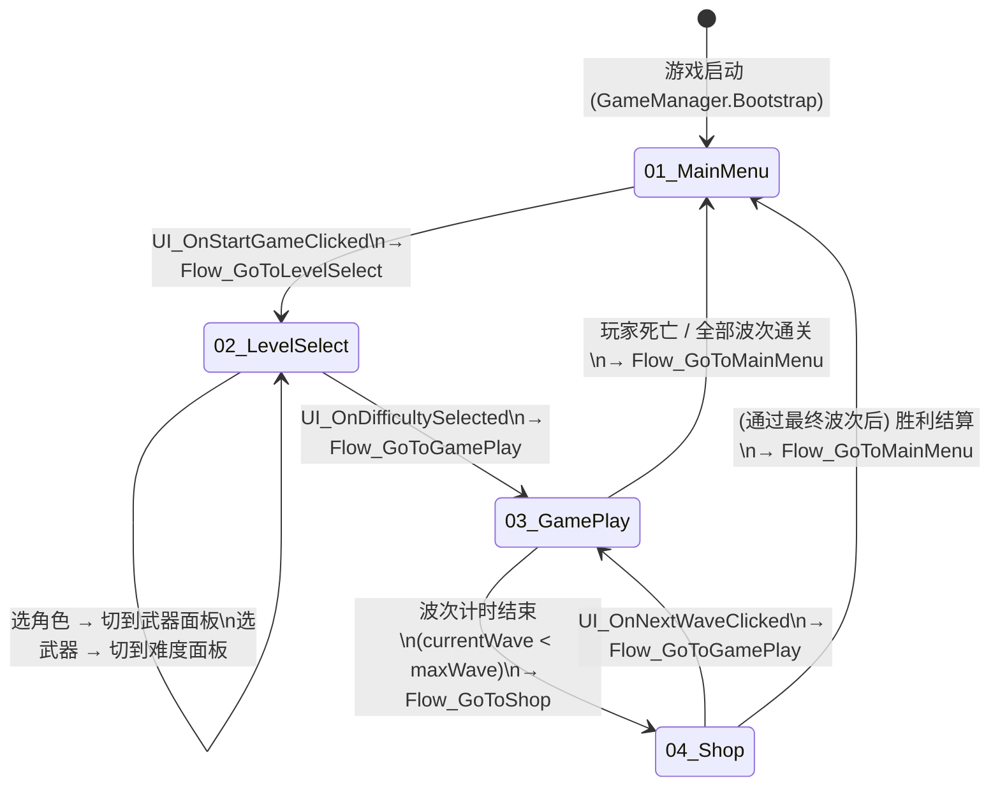

# 架构说明文档 (ARCHITECTURE)

> 版本：2025 重构版 · 适用场景：实习作品集 / 商业化演示

---

## 目录
1. [模块职责说明](#1-模块职责说明)
2. [事件约定](#2-事件约定)
3. [场景状态流转](#3-场景状态流转)
4. [目录结构](#4-目录结构)
5. [后续演进思路（DI）](#5-后续演进思路di)

---

## 1 模块职责说明

| 模块 | 脚本 | 职责 | 禁止做的事 |
|------|------|------|-----------|
| **事件总线** | `EventCenter` | 跨系统广播（HP变化/金币/Wave完成等）| 驱动场景跳转/UI互斥 |
| **场景流程控制** | `SceneFlowController` | 唯一切场景入口；驱动 SceneStateController | 直接操控UI面板 |
| **UI流程控制** | `UIFlowController` | 三步选择面板互斥；监听UI事件后触发Flow事件 | 直接调用 SceneManager |
| **Bootstrap/数据容器** | `GameManager` | 服务预热；跨场景运行时数据（HP/金币/选角等）| 加载JSON；切场景 |
| **配置服务** | `ConfigService` | 统一加载/缓存所有 JSON 配置文件 | 持有 MonoBehaviour |
| **进度服务** | `IProgressService` / `PlayerPrefsProgressService` | 角色解锁/通关记录的读写 | — |
| **音频服务** | `AudioMgr` | 播放BGM/SFX；监听 `Audio_Xxx` 事件 | — |
| **Mono驱动** | `MonoMgr` | 为纯C#单例提供协程与Update回调能力 | — |
| **GamePanel (HUD)** | `GamePanel` | 订阅 `Game_Xxx` 事件，刷新 HP/金币/经验/倒计时 | 直接调业务逻辑 |
| **ShopPanel** | `ShopPanel` | 购买道具/武器；点击"出发"发 `UI_OnNextWaveClicked` 事件 | 直接调 SceneManager |
| **LevelControl** | `LevelControl` | 波次计时；生成敌人；胜利/失败后发 `Flow_xxx` 事件 | 直接调 SceneManager |
| **Player** | `Player` | 移动/受伤/死亡；改变状态后发 `Game_xxx` 事件 | 直接调 GamePanel |

### 关键解耦原则
- **Panel 不互相引用**：所有面板切换统一由 `UIFlowController` 控制。
- **UI 不调 SceneManager**：所有场景跳转统一通过 `Flow_Xxx` 事件 → `SceneFlowController`。
- **游戏状态更新不直接调 UI**：Player / LevelControl 发事件，GamePanel 订阅更新。

---

## 2 事件约定

### 命名前缀规则
| 前缀 | 发送方 | 监听方 |
|------|--------|--------|
| `UI_Xxx` | Panel (用户点击) | `UIFlowController` |
| `Flow_Xxx` | `UIFlowController` / 游戏逻辑 | `SceneFlowController` |
| `Game_Xxx` | `Player` / `LevelControl` | `GamePanel` / 其他系统 |
| `Audio_Xxx` | 任意 | `AudioMgr` |

### 完整事件表

```
UI_OnStartGameClicked       无参   主菜单"开始"按钮
UI_OnRoleSelected           RoleData
UI_OnWeaponSelected         WeaponData
UI_OnDifficultySelected     DifficultyData
UI_OnNextWaveClicked        无参   商店"出发"按钮
UI_OnShopRefreshClicked     无参
UI_OnShopBuyClicked         ItemData

Flow_GoToMainMenu           无参
Flow_GoToLevelSelect        无参
Flow_GoToGamePlay           无参
Flow_GoToShop               无参

Game_PlayerHpChanged        float  当前HP
Game_PlayerMoneyChanged     float  当前金币
Game_PlayerExpChanged       float  当前经验
Game_WaveTimerChanged       float  波次倒计时
Game_WaveCompleted          int    完成波次编号
Game_PlayerDead             无参
Game_EnemyDead              EnemyData

Audio_PlayBgm               无参
Audio_StopBgm               无参
Audio_PlaySfx               ...
Audio_SetVolume             float
```

---

## 3 场景状态流转

### Mermaid 状态图



### 时序说明

```
玩家点击"开始"
  → BeginScenePanel 发 UI_OnStartGameClicked
  → UIFlowController.OnStartGameClicked
  → 发 Flow_GoToLevelSelect
  → SceneFlowController.GoToLevelSelect
  → SceneStateController.SetState(new SelectSecene)
  → SceneManager.LoadSceneAsync("02-LevelSelect")
```

---

## 4 目录结构

```
Assets/
├── Scripts/
│   ├── Framework/          核心框架（EventCenter, E_EventType, MonoMgr, BaseMgr,
│   │                                  GameManager, AudioMgr）
│   ├── SceneState/         场景状态机（ISceneState, SceneStateController,
│   │                                   StartScene, SelectSecene, GameScene, ShopScene）
│   ├── Core/               新增模块（SceneFlowController）
│   ├── Services/           新增服务层（ConfigService, IProgressService）
│   ├── UI/
│   │   ├── UIFlowController.cs   新增：UI面板互斥/流程控制
│   │   ├── BeginScenePanel.cs
│   │   ├── SelectPanel/          RoleSelectPanel, WeaponSelectPanel,
│   │   │                         DifficultySelectPanel, RoleUI, WeaponUI, DifficultyUI
│   │   └── GamePanel/            GamePanel, ShopPanel, ItemCardUI, WeaponSlot...
│   ├── Player/             Player.cs
│   ├── Control/            LevelControl.cs
│   ├── Enemy/              EnemyBase, EnemyXxx...
│   ├── Weapons/            WeaponBase, WeaponXxx...
│   └── Domain/             数据模型（RoleData, WeaponData, EnemyData, PropData,
│                                       DifficultyData, LevelData, WaveData, ItemData）
├── Data/                   JSON配置（role, weapon, enemy, prop, difficulty, levelXxx）
└── docs/
    └── ARCHITECTURE.md     本文档
```

---

## 5 后续演进思路（DI）

> 当前使用**单例**（`BaseMgr<T>` / `BaseMgrMono<T>`），适合快速迭代和小型团队。  
> 下面说明如何在不破坏现有接口的情况下，逐步演进到**依赖注入**。

### 步骤一：引入 ServiceLocator（过渡期）

```csharp
// 替换
var cfg = ConfigService.Instance;

// 改为
var cfg = ServiceLocator.Get<IConfigService>();
```

好处：调用方不再硬绑定到具体类，只依赖接口；测试时可注入 Mock。

### 步骤二：选择 DI 框架

推荐：
- **Zenject / Extenject**（Unity 生态最成熟）
- **VContainer**（更轻量，推荐 2024+ 新项目）

### 步骤三：改造 Bootstrap

```csharp
// 当前
_ = ConfigService.Instance;

// Zenject 方式
Container.Bind<IConfigService>().To<ConfigService>().AsSingle();
Container.Bind<IProgressService>().To<PlayerPrefsProgressService>().AsSingle();
Container.Bind<SceneFlowController>().AsSingle().NonLazy();
```

### 步骤四：构造注入 vs 方法注入

对于 MonoBehaviour（无法构造注入），使用 `[Inject]` 方法注入：

```csharp
public class GamePanel : MonoBehaviour
{
    private IConfigService _config;

    [Inject]
    public void Construct(IConfigService config) => _config = config;
}
```

### 关键收益

- 单元测试：注入 Mock 数据，无需加载真实场景。
- 热更新友好：接口稳定，实现可随时替换。
- 减少全局状态：消除大部分跨场景单例，降低 `DontDestroyOnLoad` 对象数量。
